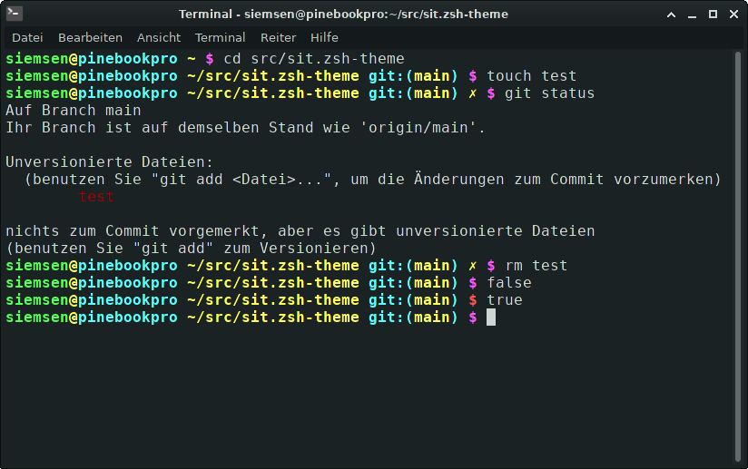

sit - A plain and simple zsh-theme
==================================

Prompt features
---------------
 * Git status
 * Current path: Displays current working directory
 * Return status: Shows error return code (red/magenta)

Example
-------

Installation
------------

Clone the repository into your custom oh-my-zsh themes folder:

    git clone https://github.com/svensen/sit.zsh-theme.git ${ZSH_CUSTOM}/themes/sit

Set the theme in your .zshrc:

   ZSH_THEME="sit/sit"

